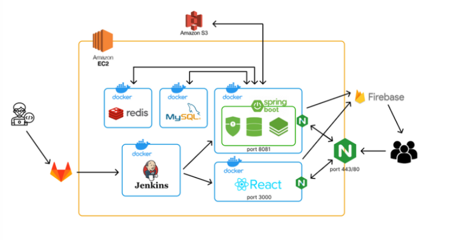
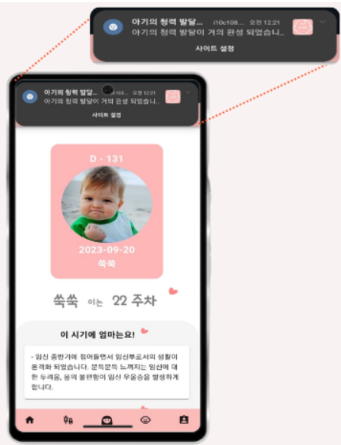
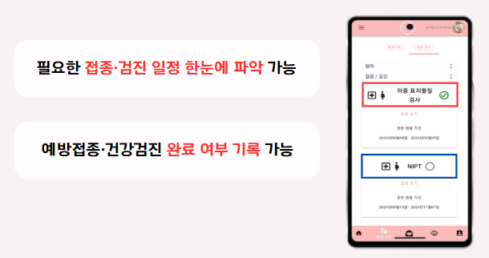
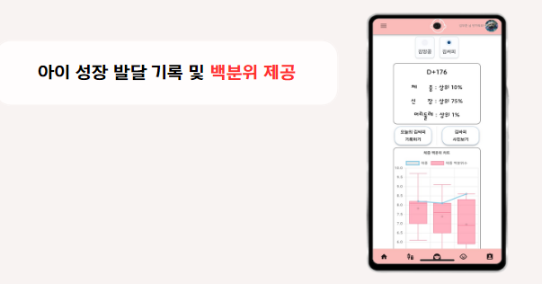
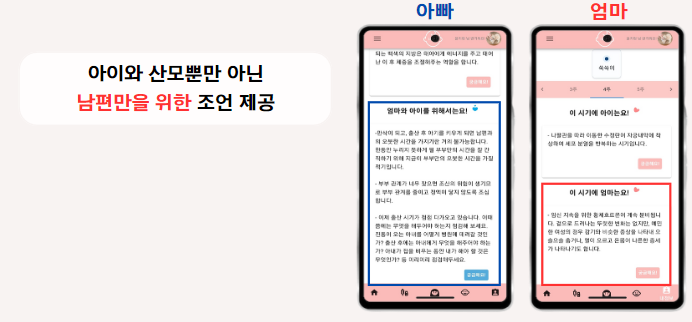
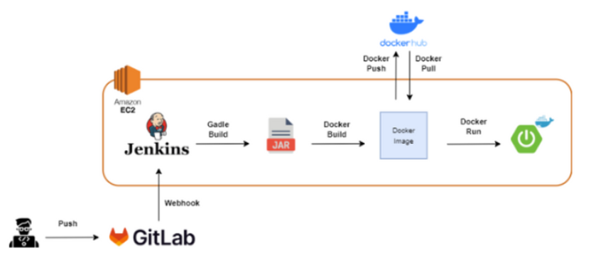
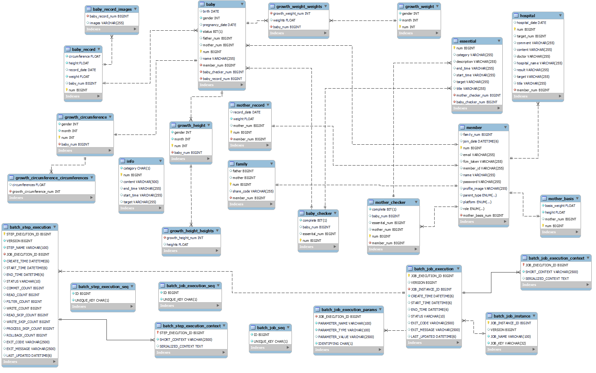
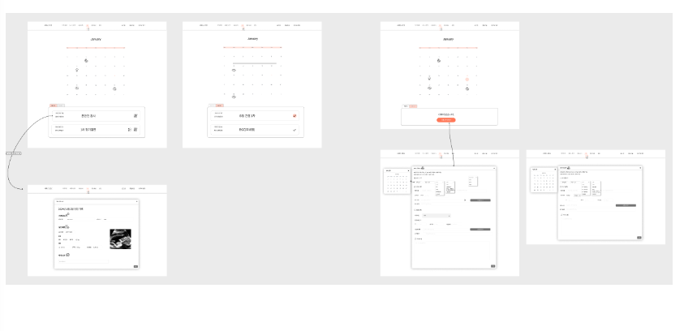

# I&WE

임신부터 출산, 육아까지
**통합 육아 도우미 서비스**

## :baby: 프로젝트 소개

2024.01.07 ~ 2024.02.16 (6주)

총 6명 (FE 3명, BE 3명)

 
 
    
## 🤔 기획 의도

무엇을 모르는지 모르는 엄마들을 위해
어디서 찾아야할지 헤매는 아빠들을 위해

**“임신부터 출산, 육아까지”**

필요한 정보를 자동 제공해주는

**I & WE**

   

## ⚙ 개발 환경

**FE**

**BE**

**DevOps**

 

    
**협업**

 
 
     
 

## 💾 기술 스택

 
 

## ✅ 주요 기능 및 화면

### 시기에 따른 정보 알람 제공

  

### 필수 검사, 검진, 접종 여부 체크

### 아이 성장 데이터 백분위 제공

### 남편, 아내에 따른 데이터 제공

    
## ✅ CI / CD 파이프라인

 
 
 
    
## ✅ ER 다이어그램

  
  

## ✅ API 명세서

  
  

## ✅ 화면 정의서

  

## ✅ 팀원소개

**Front End**
정유나, 전승혜, 김무준

**Back End**
서지현, 예준성, 윤지현

