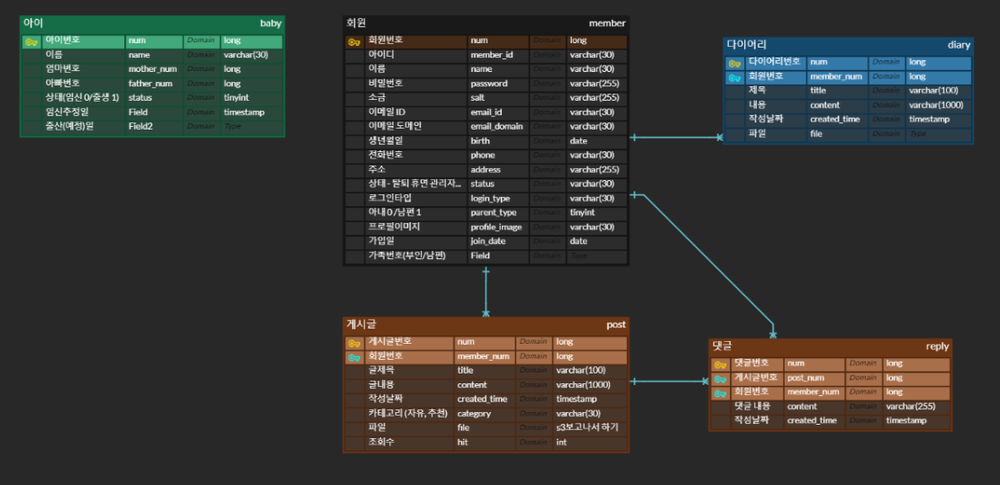
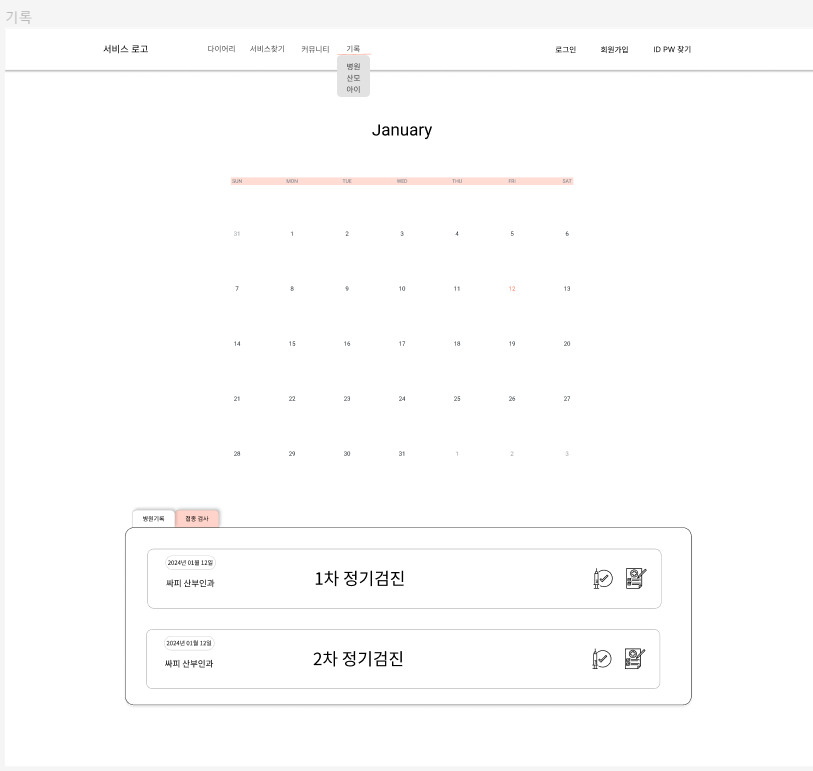
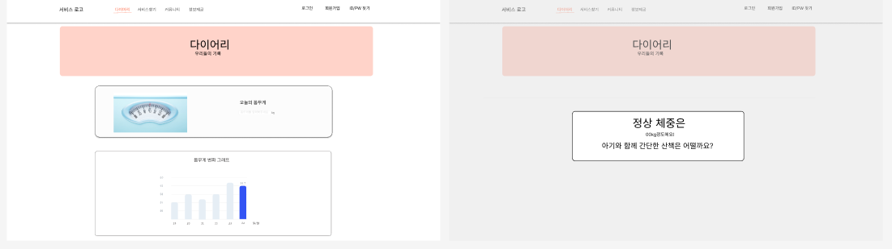

# 기획 배경
- 초보 엄마, 아빠는 자신이 모르는게 뭔지 모를 정도로 모르는게 많다.  
    - 아이를 위한 정보, 산모를 위한 정보, 보호자를 위한 정보등 필요한 정보가 너무 다양하다.  
    - 첫 아이를 준비하면서 모든 과정을 일일이 챙기기 힘들다.   
- 아이의 성장 데이터를 기록하고 싶다.  
    - 임신부터 출산, 육아까지 장기적인 관리가 필요하다.	-> 출산 전부터 이후까지 시기별 필요정보 정보  
    - 내 아이의 성장을 한눈에 보고싶다. -> 성장과정기록   
    - 내 아이가 잘 자라고있는지 궁금하다. -> 상대적인 발육정도(백분위) 비교  
- 아이뿐만 아닌 산모와 보호자를 위한 서비스가 필요하다.  
    - 산모의 심리적인 상태 케어가 필요하다. -> 다이어리   
    - 산모와 보호자(남편)의 소통이 중요하다. -> webRTC를 이용한 화상 통화  
   
# 상세기능  
1. 회원관리  
    - 로그인  /  회원가입 / 로그아웃 / 내정보수정 /회원 탈퇴  
2. 정보 제공  
    (1)사용자에 따른 맞춤형 정보 제공  
    - 산모  
        - ex. 숨이 자주 가빠지고 소화가 잘 안되며 소변을 자주 보게 돼요. 또 자신도 모르게 소변이 샐 수도 있습니다. 임산부용 면 팬티라이너 등을 착용하고, 꾸준한 골반 운동으로 골반 근육을 강화시켜 주세요.  
    - 보호자  
        - ex.  이 시기의 태아는 소리를 들을 수 있으므로 책을 읽어주세요. 아빠가 읽어주는 것도 임신의 즐거움을 공유할 수 있는 좋은 방법입니다.  

    (2)시기에 따른 맞춤형 정보 제공  
     - 	점점 자유롭게 움직이고, 태동이 확실해지며, 위치가 자주 변해요 !  
     - 	이 시기는 쑥쑥이 손가락 생기는중입니다  
     -	오감이 발달하고 있어요. 아이가 춥지 않도록 따뜻하게 보호해주세요.  
    
    (3)접종관련 정보 제공 + 알림  

    (4)건강검진 관련 정보 제공 + 알림 
    
    (5)기록을 기반으로 한 시각화 및 분석 결과 제공(공유다이어리)  
    - 산모 체중 기록, 권장 체중 시각화 및 분석 제공  
        - ex)  최근 체중증가률이 높습니다. 체중증가 주의해주세요. 과도한 체중증가는 임신성 당뇨 발병의 위험성이 증가합니다.  
    - 세계보건기구 발달기준과 내 아이 발달기록 시각화 및 분석 제공    
        - ex) 현재 쑥쑥이 체중은 상위 5%입니다.
3. 커뮤니티    
    - 카테고리 별로 게시판을 제공(자유글, 용품추천)    
    - 작성자의 프로필을 눌러 채팅가능                
4. 다이어리(일기)  
    -  산모의 기분, 산모의 감정 등을 기록  

5. 기록 (산모체중, 우리아이발달기록, 병원기록)
    - 산모 체중 기록 -> 체중 변화 측정 => 2.(5)와 연결
    - 필수, 선택 접종 여부 기록
    - 필수, 선택 건강검진 여부 기록
    - 아이 발달 기록 (키, 체중, 머리둘레)
    - 병원 검진 기록 

6. 주변 찾기(산부인과, 산후조리원 등) 
    - 현재 접속한 위치를 기반으로 주변 필요한 인프라에 대한 정보를 KAKAO MAP API를 활용하여 제공한다.
    - 접속 위치 정보 제공 거부 시, 가입 시 입력한 주소를 기반으로 제공한다.

7. 가족과의 영상통화 기능
    - 산모, 보호자들 간의 영상통화 기능 제공
    - 산모 데이터 활용 보호자의 케어 유도 ex) 지금은 우울증에 걸리기 쉬운 시기에요. 아내에게 따뜻한 영상통화 어떠세요?

8. 마이페이지
    - 아이, 산모, 보호자 정보수정
    - 아이, 보호자 추가

# Commit Convention

## [태그] 제목의 형태이며, [태그]뒤에만 space가 있음에 유의한다.
> [feat] 새로운 기능 추가  
> [fix] 버그 수정  
[docs] 문서 수정  
[style] 코드 포맷팅, 세미콜론 누락, 코드 변경이 없는 경우  
[refactor] 코드 리펙토링  
[test] 테스트 코드, 리펙토링 테스트 코드 추가  
[chore] 빌드 업무 수정, 패키지 매니저 수정

# Entity Relationship Diagram
  

# 기록 화면정의서 작성

